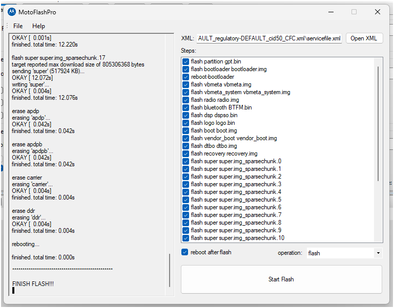

# Moto services

- <https://lineageos.org/>
- <https://xdaforums.com/f/moto-edge-30-pro.12543/>
- <https://4pda.to/forum/index.php?showtopic=1053226&view=findpost&p=142630947>
- <https://xdaforums.com/t/rom-unofficial-lineageos-23-android-16-for-the-motorola-edge-30-pro-motorola-edge-2022-motorola-edge-x30-hiphi-hiphic-hiphid.4784104/>

## ADB Usage

`O:\Install\Android\platform-tools>`

```shell
adb.exe devices
List of devices attached
ZY22F39NFR      device

adb.exe sideload

# ALso fastboot
adb.exe reboot fastboot
adb.exe reboot bootloader
fastboot devices
```

## Recovery flash

```shell
adb.exe reboot bootloader
fastboot devices
# See below
```

## Sideload

```shell
adb -d reboot sideload
adb -d sideload /path/to/zip
adb sideload filename.zip
```

## Boot unlock

- <https://en-us.support.motorola.com/app/standalone/bootloader/unlock-your-device-b/>

O:\Install\Android\platform-tools>fastboot oem get_unlock_data
< waiting for any device >
(bootloader) Unlock data:
(bootloader) 00000000000000000000000000000000000000000
(bootloader) 00000000000000000000000000000000000000000
(bootloader) 00000000000000000000000000000000000000000
(bootloader) 00000000000000000000000000000000000000000
(bootloader) 00000000000000000000000000000000000000000
OKAY [  0.036s]
Finished. Total time: 0.040s


fastboot oem unlock <CODE>


## Official 14th

- <https://xdaforums.com/t/update-to-android-14-said-by-motorola.4695456/>

```txt
1. Download the file and extract the .zip file to somewhere.
2. Enable unlocked bootloader in developer settings.
3. Make sure the Motorola ADB drivers are installed.
4. Plug the phone into the computer, reboot into Fastboot (hold power+volume down when turning the phone on).
5. Use the motoflashpro utility available from here: https://xdaforums.com/t/utility-motoflashpro.4252201/
6. In motoflashpro select [Open XML] and find your unzipped folder.

IMPORTANT: Select servicefile.xml to do an in-place upgrade (shouldn't wipe anything) - flashfile.xml will wipe the phone and do a clean install.

7. Press the big [Start Flash] button in motoflashpro and it should install

```



## Lineage OS

Use standart recovery:

- <https://droidrecovery.com/motorola-edge-30-pro-recovery-mode/>
- <https://xdaforums.com/t/device-unauthorized-in-recovery-mode.4232895/post-84998953>

### Standart recovery (don't use for sideload):

```shell
adb.exe reboot recovery
# See android with red exclamation IS OK!
```

1. See android with red exclamation IS OK!
2. Hold power button
3. Click volume button UP once and release power butt
4. True recovery meny should appear

### Lineage OS recovery (use)

- <https://twrp.me/motorola/motorolamotoedge.html>
Temp recovery (don't use)

```shell
adb reboot bootloader
fastboot devices
fastboot flash recovery O:\\Install\\Android\\OS\\MotoEdge30Pro\\LineageOS_Unoff\\recovery.img
# Sending 'recovery_b' (102400 KB)                   OKAY [  2.444s]
# Writing 'recovery_b'                               OKAY [  0.727s]
# Finished. Total time: 3.182s

# Move to recovery via volume buttons
# See lineageOS recovery

# AGAIN when failed (did not help)
fastboot flash recovery O:\\Install\\Android\\OS\\MotoEdge30Pro\\LineageOS_Unoff\\recovery.img
Sending 'recovery_a' (102400 KB)                   OKAY [  2.384s]
Writing 'recovery_a'                               OKAY [  0.578s]
Finished. Total time: 2.974s

#  (did not help)
fastboot flash recovery_b O:\\Install\\Android\\OS\\MotoEdge30Pro\\LineageOS_Unoff\\recovery.img
fastboot flash recovery_a O:\\Install\\Android\\OS\\MotoEdge30Pro\\LineageOS_Unoff\\recovery.img
# fastboot boot O:\\Install\\Android\\OS\\MotoEdge30Pro\\LineageOS_Unoff\\recovery.img

# Try alt (did not help)
fastboot flash recovery O:\\Install\\Android\\OS\\MotoEdge30Pro\\recovery\\TWRP\\recovery.img
fastboot flash recovery_b O:\\Install\\Android\\OS\\MotoEdge30Pro\\recovery\\TWRP\\recovery.img
fastboot flash recovery_a O:\\Install\\Android\\OS\\MotoEdge30Pro\\recovery\\TWRP\\recovery.img
# fastboot boot O:\\Install\\Android\\OS\\MotoEdge30Pro\\recovery\\TWRP\\recovery.img

# Try official recovery  (did not help)
fastboot flash recovery O:\\Install\\Android\\OS\\MotoEdge30Pro\\Off_14\\recovery.img
fastboot flash recovery_a O:\\Install\\Android\\OS\\MotoEdge30Pro\\Off_14\\recovery.img
fastboot flash recovery_b O:\\Install\\Android\\OS\\MotoEdge30Pro\\Off_14\\recovery.img
fastboot flash boot O:\\Install\\Android\\OS\\MotoEdge30Pro\\Off_14\\boot.img
fastboot flash boot_a O:\\Install\\Android\\OS\\MotoEdge30Pro\\Off_14\\boot.img
fastboot flash boot_b O:\\Install\\Android\\OS\\MotoEdge30Pro\\Off_14\\boot.img

# Worked
fastboot set_active b
fastboot reboot recovery
# Now I got back into LineageOS recovery!
fastboot set_active a
fastboot reboot recovery
```

### Lineage OS Recovery, ROM, Gapps

Only use LineageOS recovery installed at previous step.

```shell
adb.exe devices
adb.exe reboot recovery
# check the standart recovery instruction from above

# Check
adb.exe devices
# List of devices attached
# ZY22F39NFR      sideload

# ALT
fastboot flash boot O:\\Install\\Android\\OS\\MotoEdge30Pro\\LineageOS_Unoff\\boot.img
fastboot flash dtbo O:\\Install\\Android\\OS\\MotoEdge30Pro\\LineageOS_Unoff\\dtbo.img
# ??? no such img in 30 pro
# fastboot flash init_boot init_boot.img
fastboot flash vendor_boot O:\\Install\\Android\\OS\\MotoEdge30Pro\\LineageOS_Unoff\\vendor_boot.img
fastboot flash vbmeta --disable-verity --disable-verification O:\\Install\\Android\\OS\\MotoEdge30Pro\\LineageOS_Unoff\\vbmeta.img

# ADB Sideload activated in recovery menu
adb.exe -d sideload O:\\Install\\Android\\OS\\MotoEdge30Pro\\LineageOS_Unoff\\copy-partitions-20220613-signed.zip
# Total xfer: 1.00x
# With LineageOS recovery:
# [OK]

# Reboot to recovery: Advanced menu
# ROM install (ADB Sideload activated in recovery menu)
adb.exe -d sideload O:\\Install\\Android\\OS\\MotoEdge30Pro\\LineageOS_Unoff\\lineage-23.2-20260401-UNOFFICIAL-hiphi.zip
# Reboot to recovery (via dialog: Yes)

##############
# Failed to get into recovery: try flashing recovery again in fastboot mode!
# Possible fix: change slot
##############
fastboot set_active b
# Try to get back into recovery again

# Reboot to recovery: Advanced menu
# Gapps (ADB Sideload activated in recovery menu)
adb.exe -d sideload O:\\Install\\Android\\OS\\MotoEdge30Pro\\LineageOS_Unoff\\MindTheGapps-16.0.0-arm64-20260216_221300.zip
adb.exe -d sideload O:\\Install\\Android\\OS\\MotoEdge30Pro\\LineageOS_Unoff\\MindTheGapps-16.0.0-arm64-20250812_214353.zip

```

### Off images back:

```shell

fastboot flash boot "O:\Install\Android\OS\MotoEdge30Pro\Off_14\boot.img"
fastboot flash dtbo "O:\Install\Android\OS\MotoEdge30Pro\Off_14\dtbo.img"
fastboot flash vendor_boot "O:\Install\Android\OS\MotoEdge30Pro\Off_14\vendor_boot.img"
fastboot flash vbmeta "O:\Install\Android\OS\MotoEdge30Pro\Off_14\vbmeta.img"
fastboot flash recovery "O:\Install\Android\OS\MotoEdge30Pro\Off_14\recovery.img"

fastboot set_active b
fastboot reboot recovery
```


### Start over

- <https://wiki.lineageos.org/devices/dubai/install/#flashing-additional-partitions>

When recovery is wrong: `Writing 'boot_a'                                   (bootloader) Preflash validation failed`

```shell
fastboot.exe flash dtbo O:\\Install\\Android\\OS\\MotoEdge30Pro\\LineageOS_Unoff\\dtbo.img
fastboot.exe flash vendor_boot O:\\Install\\Android\\OS\\MotoEdge30Pro\\LineageOS_Unoff\\vendor_boot.img
fastboot.exe reboot bootloader

fastboot.exe flash boot O:\\Install\\Android\\OS\\MotoEdge30Pro\\LineageOS_Unoff\\boot.img
fastboot.exe flash boot_a O:\\Install\\Android\\OS\\MotoEdge30Pro\\LineageOS_Unoff\\boot.img
fastboot.exe flash boot_b O:\\Install\\Android\\OS\\MotoEdge30Pro\\LineageOS_Unoff\\boot.img
fastboot set_active b
fastboot set_active a
fastboot reboot recovery

# ADB Sideload activated in recovery menu
adb.exe -d sideload O:\\Install\\Android\\OS\\MotoEdge30Pro\\LineageOS_Unoff\\copy-partitions-20220613-signed.zip
```