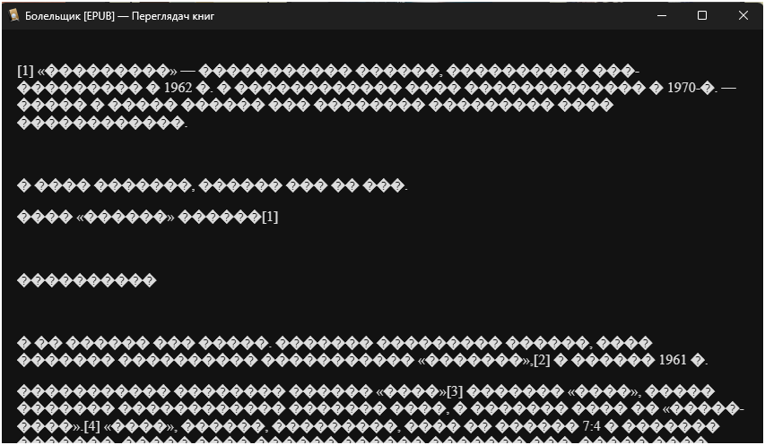

# Converting files for Kindle

- Use Calibre
- Use PS script


The issue:



Can be cured by manually open the RTF and saving as HTML.
Mass converting can help too, here is a script to convert RTF to DOCX

- https://steveknutson.blog/2021/06/09/converting-word-document-format-with-powershell/


```
$path = "O:\Books\Convertion" 
$word_app = New-Object -ComObject Word.Application

$Format = [Microsoft.Office.Interop.Word.WdSaveFormat]::wdFormatXMLDocument

Get-ChildItem -Path $path -Filter *.rtf | ForEach-Object {
    $document = $word_app.Documents.Open($_.FullName)
    $docx_filename = "$($_.DirectoryName)\$($_.BaseName).docx"
    $document.SaveAs([ref] $docx_filename, [ref]$Format)
    $document.Close()
}
$word_app.Quit()
```

Check the result and mass convert DOCX to EPUB if needed or import books as DOCx and convert in Calibre UI

- https://manual.calibre-ebook.com/en/generated/en/ebook-convert.html#docx-output-options
