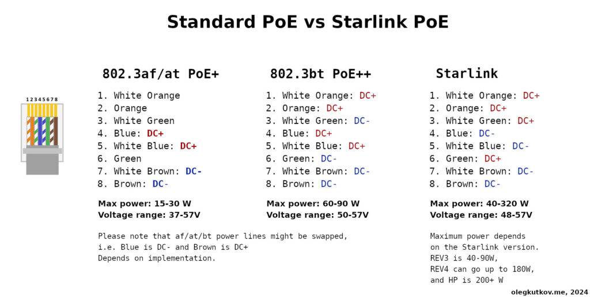
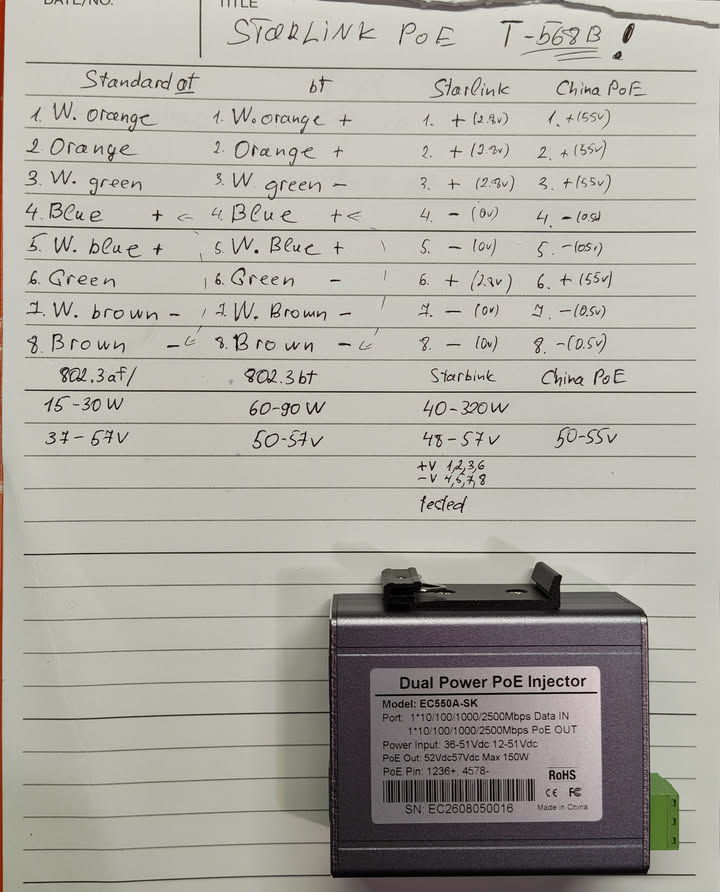
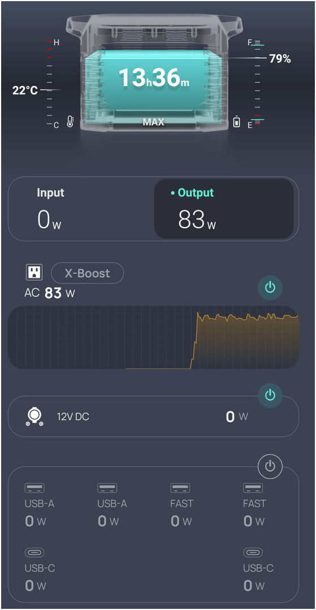
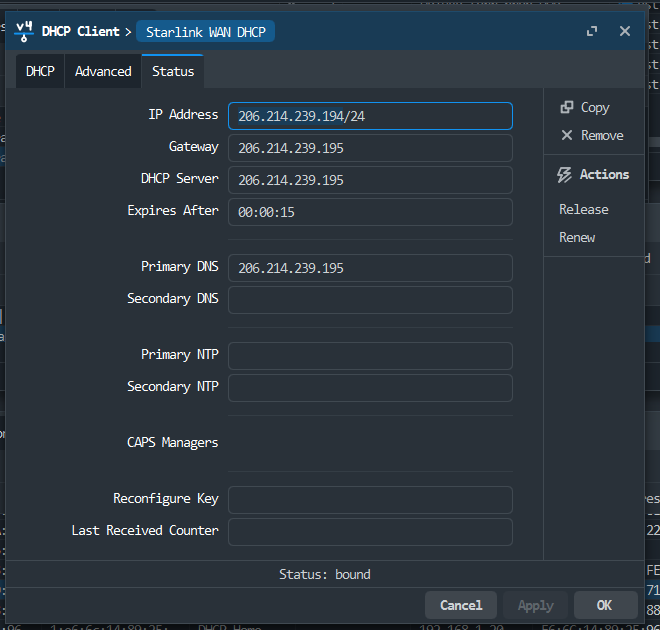

# Starlink and Network

Apps and soft to use:

- <https://play.google.com/store/apps/details?id=com.stardebug&hl=en-US>
- <https://github.com/DaveyHert/Dishylink>

Starlink PoE hacks:

- <https://gist.github.com/darconeous/8c7899c4d2f849b881d6c43be55066ee>
- <https://wxplink.com/products/5-in-1-starlink-poe-injector-for-starlink-gen-2-same-day-shipping>

Starlink internals:

- <https://olegkutkov.me/2023/11/07/connecting-external-gps-antenna-to-the-starlink-terminal/>
- <https://olegkutkov.me/2024/12/31/starlink-rev-3-v2-power-architecture/>
- <https://olegkutkov.me/2024/08/04/powering-starlink-rev4-v3-from-the-12v-without-poe-injector-router/>
- <https://olegkutkov.me/2023/06/09/how-to-power-starlink-terminal-from-12v-without-poe-injector-and-dc-dc-converters/>

Access from the word into Starlink:
- <https://starlink-tips.com/guides/tips-tricks/starlink-cgnat-port-forwarding-remote-access>

## Pics

Starlink VS starndard PoE



Starlink With china PoE injector tested:

Starlink router - pins tested
China Injector - pins tested



Power Use



### Network setups


`MikroTik and Starlink Configuration: Complete Setup Guide for Network Engineers`

- <https://tech.layer-x.com/mikrotik-and-starlink-configuration-complete-setup-guide-for-network-engineers/>

Starlink Dish with direct PoE:

- <https://starlink.com/tc/support/article/1192f3ef-2a17-31d9-261a-a59d215629f4>
- <https://www.reddit.com/r/StarlinkEngineering/comments/thr4dr/howto_diy_poe_and_ethernet_for_rectangle_dishy/>



- IP Addr `206.214.239.194/24`
- GW `206.214.239.195`
- DHCP `206.214.239.195`

`The IP address 206.214.239.194 indicates that Starlink is not connected to our Point of Presence (PoP) and therefore unable to receive its allocated IP address. The default 206.214.239.194 address is expected when Starlink is not connected to the PoP.`

Bypass and route:

- <https://forum.mikrotik.com/t/starlink-and-static-routes/164195>

Access Starlink debug data even in bypass mode:

- Dish IP: 192.168.100.1
- Statistics URL: http://192.168.100.1/statistics
- gRPC API: Available for advanced monitoring


`
To add a route to Starlink in bypass mode on a Mikrotik router, you need to create a static route for 192.168.100.1/32 pointing to the interface that faces Starlink, typically using the command /ip route add dst-address=192.168.100.1/32 gateway=eth1. Make sure there are no firewall rules blocking access to that IP from your LAN.
`

```shell
/ip route add dst-address=192.168.100.1/32 gateway=eth1
ping 192.168.100.1
```

